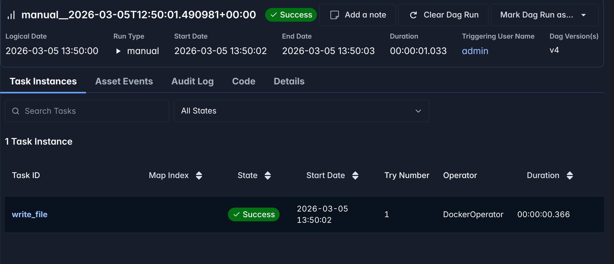

Ever tried to run Docker commands inside an Airflow task? If you have, you might have encountered the infamous "bind source path does not exist". This error occurs when you try to mount a directory from the host machine into a Docker container running as part of an Airflow task, but the path you specified does not exist on the host. This can be particularly tricky when using Docker in Docker (DinD) setups, where the Airflow container itself is running inside another Docker container.

I recently built a containerized ETL pipeline where Airflow orchestrates extractor and loader containers every 15 minutes. Everything worked except this one critical piece: **mounting host directories into the task containers**. The Docker daemon kept complaining that paths didn't exist, even though they were right there in the Airflow container.

The core issue? **The Docker daemon runs on the host, not inside containers.** It needs host paths, not container paths. But how do you get host paths into your DAG without hardcoding?

After much trial and error, I found a clean, portable solution using an environment variable and the `$PWD` trick. In this post, I'll walk you through the problem, the false starts, and the final solution that lets your DAGs run anywhere.

## The Problem

I was orchestrating some tasks in my pipeline that required building and running Docker containers. My pipeline had multiple services a dbase, couple of apps, a custom network to connect everything.  I wanted to use Airflow to manage the orchestration for development and testing. So i had a `DockerOperator` in my DAG that just run the database service and report it readiness. This `DockerOperator` had a couple of mounted volumes. For the sake of simplicity, let's say, i have two tasks in my DAG as follows:

```python
write = DockerOperator(
    task_id='write_file',
    image='alpine:latest',
    command=['sh', '-c', 'echo "Hello from Airflow!" > /data/hello.txt'],
    volumes=['./data:/tmp/data'],
    dag=dag
)
```

So simply, this task just runs an `Alpine` container that writes a file to a mounted volume. the `data` directory in the current directory (project directory) is mounted to the `/tmp/data` address of the container.

![]screenshot_scheule.png

When the task is triggered, I got the following error in the logs:

```bash

Log message source details sources=["/opt/airflow/logs/dag_id=test_write/run_id=manual__2026-03-05T11:56:15.919232+00:00/task_id=write_file/attempt=1.log"]
[2026-03-05 12:56:16] INFO - DAG bundles loaded: dags-folder
[2026-03-05 12:56:16] INFO - Filling up the DagBag from /opt/airflow/dags/test.py
[2026-03-05 12:56:16] INFO - Starting docker container from image alpine:latest
[2026-03-05 12:56:16] ERROR - Task failed with exception
APIError: 400 Client Error for http+docker://localhost/v1.53/containers/create: Bad Request ("invalid mount config for type "bind": invalid mount path: './data' mount path must be absolute")

```
So the error is pretty clear, the source mount path must be absolute. But this is where it is tricky. Because my absolute path to the source directory is not the same as anyone  else who runs this pipeline. So how can we solve this issue?

As a first step, I tried to dynamically obtain the absolute path from the DAG script and pass it to the `DockerOperator` as follows:

```python
import os
from airflow import DAG
from airflow.providers.docker.operators.docker import DockerOperator
from datetime import datetime


default_args = {
    'start_date': datetime(2026, 3, 1),
    'auto_remove': 'success'
}

host_path = os.path.abspath('./data')

with DAG('test_write',
	default_args = default_args,
	schedule = '@once',
	catchup = False) as dag:

	write = DockerOperator(
		task_id='write_file',
		image='alpine:latest',
		command=['sh', '-c', 'echo "Hello from Airflow!" > /tmp/data/hello.txt'],
		mounts=[Mount(source='./data',
					  target='/tmp/data',
					  type = 'bind')],
		dag=dag)

```

 This however didn't work because the script runs inside the Airflow container, so `os.path.abspath('./data')` returns `/opt/airflow/data` — a path that exists **inside the container** but not on the **host**. The Docker daemon, running on the host, needs the **host's absolute path**, not the container's path.


## The Solution: Use Environment Variables

Using environment variables is a common way to pass dynamic values to your Airflow tasks. In this case, we can set an environment variable that contains the absolute path to the `data` directory on the host machine, and then use that environment variable in the `DockerOperator` to specify the mount path.

The fist step is set environment variable in the Airflow container. This can be done by adding the following line to your `docker-compose.yml` file for the Airflow service:

```yaml
services:
  airflow-manager:
    image: airflow-with-docker:latest # This image was bult locally on the apache/airflow 3.0.0 with necessary modules  installed so that the container has access to `DockerOperator`.
    environment:
      AIRFLOW__CORE__EXECUTOR: LocalExecutor
      ...
      HOST_PWD: $PWD # <- Set the environment variable to the current working directory on the host machine 
      ...
    volumes:
      - ./data:/tmp/data # <- Mount the data directory to the Airflow container so that it can be accessed by the DockerOperator
    ...

```

There are **two separate mounts** at play here:

 1. **docker-compose mount**: `./data:/tmp/data` makes your host's `./data` available to the Airflow container at `/tmp/data`
 2. **DockerOperator mount**: `source=f"{host_path}/data"` tells Docker daemon to mount the **host's** `./data` to the task container at `/tmp/data`
 
 The first mount ensures the Airflow container can see the data, but the Docker daemon ignores it. The second mount gives the actual task container access.

Let's modify our DAG to set an environment variable for the host path and then use it in the `DockerOperator`:

```python
import os
from airflow import DAG
from airflow.providers.docker.operators.docker import DockerOperator, Mount
from datetime import datetime

default_args = {
	'start_date': datetime(2026,3,1),
	'auto_remove': 'success'}


host_path = os.environ.get('HOST_PWD')

with DAG('test_write',
	default_args = default_args,
	schedule = '@once',
	catchup = False) as dag:


	write = DockerOperator(
		task_id='write_file',
		image='alpine:latest',
		command=['sh', '-c', 'echo "Hello from Airflow!" > /tmp/data/hello.txt'],
		mounts=[Mount(source=f"{host_path}/data", # <- this will now be dynamically addressed and accessible
					  target='/tmp/data',
					  type = 'bind')],
		dag=dag)
```

Upon running the DAG, the `DockerOperator` will now be able to access the `data` directory on the host machine through the environment variable, and the task should execute successfully without any mount path issues.




We can also verify that the file was created successfully by checking the contents of the `data` directory on the host machine:

```bash
$ cat ./data/hello.txt
Hello from Airflow!
```

## Conclusion
Using environment variables is a powerful way to pass dynamic values to your Airflow tasks, especially when dealing with Docker in Docker scenarios. By setting an environment variable for the host path and using it in the `DockerOperator`, we can solve the mount path issue and enable seamless containerized task execution within Airflow. This approach allows for greater flexibility and portability of your Airflow DAGs across different environments.

