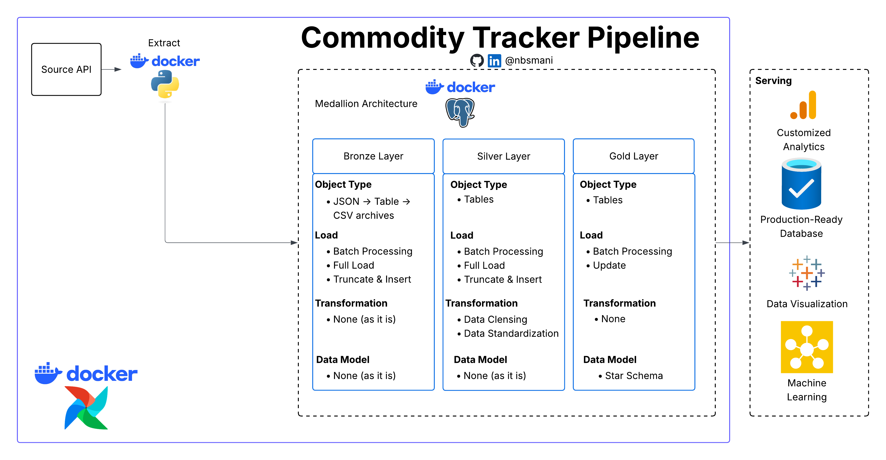

Data is pulled from the [Gold API](https://gold-api.com/). This API is a Free endpoint with no rate limits. The extracted data is stored in PostgreSQL with full auditability and idempotency. The data is pulled once in 15 minutes for demonstration. Time interval of the extraction can be customized in the airflow DAG.

 <!-- Using Python logo as SQLAlchemy doesn't have a dedicated simple icon -->

## ✨ Description

- Designed and built an end-to-end ETL pipeline that fetches live commodity and cryptocurrency prices (Gold, Silver, Bitcoin, Ethereum) every 15 minutes using Apache Airflow, Docker, and PostgreSQL

- Implemented medallion architecture with three data layers:

 - Bronze Layer: Raw API data with UUID batch tracking for complete data lineage and idempotent processing

 - Silver Layer: Cleaned, typed, and deduplicated data using PostgreSQL stored procedures

 - Gold Layer: Analytics-ready star schema with dimension and fact tables optimized for BI queries

- Containerized the entire stack with Docker Compose, orchestrating 5+ services including Airflow scheduler, PostgreSQL databases, and custom Python extractor/loader containers

- Solved concurrency challenges by implementing max_active_runs=1 and retry logic, eliminating "tuple concurrently updated" errors in PostgreSQL

- Automated file archival with date-partitioned directory structure, enabling efficient historical backfill and reprocessing of data

- Built idempotent load patterns using UUID-based deduplication, ensuring no duplicate records even during pipeline reruns.

- Wrote comprehensive documentation including architecture diagrams, setup instructions, and troubleshooting guides for reproducibility

## 🏗 Skills Demonstrated

Apache Airflow | Docker | PostgreSQL | Python | Pandas | SQLAlchemy | REST API Integration | Medallion Architecture | ETL Design | Data Warehousing

## 🚀 Key Achievements

- Reduced duplicate records to zero through UUID batch tracking

- Achieved 100% idempotent processing across all pipeline runs

- Successfully processed 7+ symbols with 15-minute cadence, 24/7

## Repository and Documentation

[GitHub Repository](https://github.com/nbsmani/fintrackerETLpipeline)